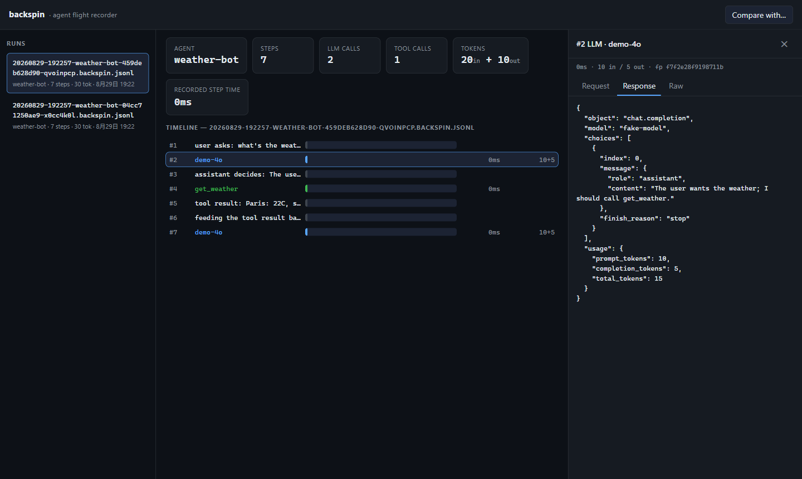
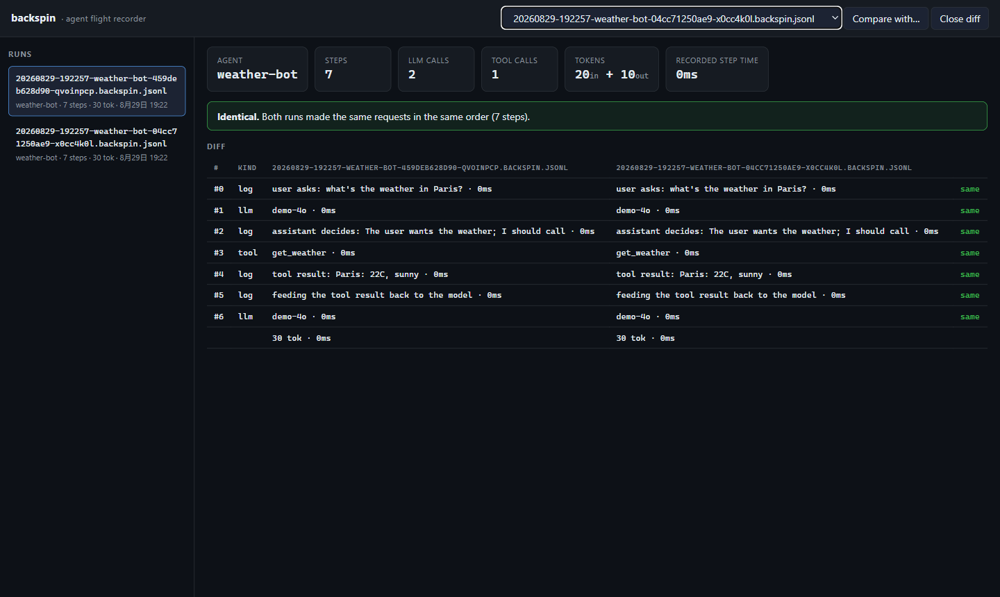

# backspin

[](https://github.com/zaibuchihuoji/backspin/actions/workflows/ci.yml)
[](https://pypi.org/project/backspin/)
[](https://pypi.org/project/backspin/)
[](LICENSE)
[](https://github.com/astral-sh/ruff)

**The flight recorder for AI agents.** Record every LLM call and tool call of an agent run into one portable file, replay the run deterministically with zero API access, and diff two runs to find the exact step where behavior diverged. 100% local, zero core dependencies.

*Think [rr](https://rr-project.org/), but for agents instead of processes.*

```python
from backspin import Recorder

with Recorder(agent="my-agent") as rec:
    client = rec.capture_openai(OpenAI())   # any code that talks to chat.completions
    ...                                     # your agent, unchanged
```

That's the whole integration. Everything the agent did — prompts, completions, tool calls, timings, token counts — is now in a single `runs/*.backspin.jsonl` file you can open, replay, diff, or attach to a bug report.

[中文文档](README.zh-CN.md)

## Why

Your agent made forty LLM calls, called three tools, and then did something weird at 2am. Good luck reproducing that from a chat log.

Cloud observability tools (Langfuse, LangSmith, AgentOps…) answer *"what happened?"* on a dashboard. **backspin answers "make it happen again, exactly."** It's a debugger, not a dashboard:

- **Record** — one context manager captures every OpenAI-shaped call (sync, async, streaming) plus your own tool calls and logs.
- **Replay** — the run becomes a *cassette*: your agent re-runs offline with recorded responses injected, deterministically. Perfect for regression tests and reproducing bugs without API keys or cost.
- **Diff** — replay the same agent against a fix and diff the two runs; backspin pinpoints the first step where they stopped matching.
- **Local-first** — runs are plain JSONL files. No server, no account, no telemetry. `git attach`-friendly: the failing run *is* the bug report.

## Install

```bash
pip install "backspin[ui]"     # SDK + CLI + local viewer
```

Core has zero dependencies; `[ui]` adds FastAPI + uvicorn for the local viewer.

**TypeScript SDK** (same run format — recordings are interchangeable across languages):

```bash
npm install github:zaibuchihuoji/backspin#sdk
```

```js
import { Recorder, captureOpenAI } from "@backspin/sdk";
```

(An npm-registry release of `@backspin/sdk` is planned; the GitHub install is prebuilt and current.)

## Record

```python
from openai import OpenAI
from backspin import Recorder

rec = Recorder(agent="support-bot")

with rec:
    client = rec.capture_openai(OpenAI())

    @rec.tool
    def lookup_order(order_id: str) -> str:
        return "shipped"

    rec.log("user asks about order #1234")
    resp = client.chat.completions.create(
        model="gpt-4o-mini",
        messages=[{"role": "user", "content": "Where is order #1234?"}],
    )

print(rec.path)   # runs/20260829-142300-support-bot-9f31c2.backspin.jsonl
```

Streaming and async clients are captured too; a streamed response is transparently reconstructed into one recorded completion.

## Replay

```python
from backspin import Cassette, load_run, stub_client

cassette = Cassette.from_run(load_run(rec.path))
stub = stub_client(cassette)

# Same agent code, zero network: responses come from the recording.
answer = run_agent(stub)
```

Requests are matched by fingerprint (model + messages) and fall back to call order with a warning. Use `backspin.replay.patch_openai(cassette)` to patch `openai.OpenAI` itself when you can't inject a client.

**In tests** this becomes deterministic agent regression testing: record once, assert forever, at zero token cost. The pytest plugin does the asserting for you:

```python
def test_my_agent(backspin):                       # pip-installed = auto-loaded
    with backspin.record(agent="t") as rec:
        run_agent(rec.capture_openai(client))
    backspin.assert_replays_identically()          # strict: fingerprint-exact replay
```

## What-if branching

The debugger superpower: change one answer, keep everything else constant, and see what the timeline looks like downstream.

```python
from backspin import branch, diff_runs, load_run

branch_path = branch("runs/live.backspin.jsonl", {0: {"content": "Rome it is."}})
report = diff_runs(load_run("runs/live.backspin.jsonl"), load_run(branch_path), llm_only=True)
print(report.first_divergence)   # the step where the two timelines split
```

Or from the CLI: `backspin branch runs/live.jsonl --step 0 --content "Rome it is."` — writes a branch run (marked `branch_of`) and prints the divergence report.

## Spans: structure, not just a flat list

```python
with rec.span("research", meta={"topic": "weather"}):
    with rec.span("tool:search"):
        ...
    resp = client.chat.completions.create(...)   # recorded inside the span
```

Every event inside a span carries its `span_id` and nesting `depth`; spans are safe under concurrency (each asyncio task gets its own stack) and the viewer renders the tree. Spans never inflate duration totals.

## Zero-code integration: `backspin proxy`

Can't (or don't want to) instrument code? Run the OpenAI-compatible local proxy and point any agent at it — any framework, any language:

```bash
backspin proxy --upstream https://api.openai.com --port 8840
# client: base_url = http://127.0.0.1:8840/v1   ← that's the whole integration
```

Every call is forwarded and captured, streaming included. Flip the same proxy into **replay mode** and it serves a recorded run back as an API — deterministic replay for agents written in any language, no SDK required:

```bash
backspin proxy --replay runs/live.backspin.jsonl --port 8840
```

## Multi-provider: OpenAI, Anthropic, and everything OpenAI-compatible

Claude natively? Same story, two lines:

```python
rec.capture_anthropic(Anthropic())   # sync/async/streaming, tool_use included
```

Anthropic events record with `provider: "anthropic"` and usage normalized to
the same token fields, so costs and diffs work across providers. And because
the proxy speaks `/v1/messages` too, Claude-native agents get the same
record-or-replay treatment with zero code changes.

Anything that speaks the OpenAI protocol (DeepSeek, Qwen, Kimi, GLM,
vLLM/Ollama, OpenRouter, …) is covered by `capture_openai` / the proxy out
of the box.

## Export, share, TUI

```bash
backspin export runs/live.jsonl --format sft -o train.jsonl   # eval/SFT datasets
backspin share runs/live.jsonl        # one self-contained HTML: run + viewer
backspin tui                          # keyboard-driven viewer for the terminal
```

`share` bundles the entire viewer and the run into a single `.html` — send it
to a teammate, they open it in a browser and step through the run. Nothing
is uploaded anywhere.

## Costs

A built-in price table (gpt-4o, claude, gemini, deepseek, …) turns token counts into money: `run.totals()["cost_usd"]`, a cost card in the viewer, `~$0.0142` in `backspin show`. Extending the table is a one-dict PR.

## Diff

```bash
backspin diff runs/live.backspin.jsonl runs/replay.backspin.jsonl
# runs diverge at step #14
#   #13  llm   gpt-4o-mini        gpt-4o-mini        yes
#   #14  llm   gpt-4o-mini        gpt-4o-mini        NO
```

Steps are aligned and signed by *what the agent chose to do* (LLM request fingerprint / tool name), so the first mismatch marks exactly where two runs stopped matching — before costs and latencies are even considered.

## CLI & local viewer

```bash
backspin ls                  # list runs: agent, steps, tokens
backspin show runs/...jsonl  # print a run's timeline
backspin show runs/... --step 7   # dump one step as JSON
backspin diff a b            # diff two runs (exit 1 if they differ)
backspin ui                  # http://127.0.0.1:8787 — timeline, inspector, diff
```

The viewer is a zero-build vanilla JS app served by the CLI: a waterfall timeline, a step inspector (request / response / raw), and side-by-side run diffing.





## Keeping secrets out of recordings

Recordings contain full prompts and completions. When that's not okay, pass a `redact` function — every payload value goes through it before touching disk:

```python
from backspin import Recorder
from backspin.redaction import mask, redact_strings

rec = Recorder(
    agent="support-bot",
    redact=redact_strings(mask(r"sk-[A-Za-z0-9]{8,}")),
)
```

Structural fields (model, tool name, fingerprint, durations) stay readable so the viewer and diff keep working; everything else — including unknown custom payload keys — passes through the redactor. Fingerprints are computed pre-redaction, so replay matching is unaffected. Note the tradeoff: a redacted run still replays, but replayed values are the redacted ones.

## The run file

One run = one self-contained JSONL file. First line is a header, every following line is a step:

```json
{"kind": "llm", "seq": 3, "ts": 1756448402.1, "model": "gpt-4o-mini",
 "duration_ms": 812.4, "fingerprint": "9f31c2ab77e01d44",
 "request": {"messages": [...]}, "response": {"choices": [...]},
 "usage": {"prompt_tokens": 120, "completion_tokens": 45}}
```

Kinds: `llm`, `tool`, `log`, `error`, plus whatever custom events you record via `rec.event(kind, **payload)`. Because a run is one file, "please attach the failing run" finally works.

## How backspin compares

| | Langfuse / LangSmith / AgentOps | backspin |
|---|---|---|
| Question it answers | what happened? | make it happen again, exactly |
| Where | cloud SaaS | your machine, plain files |
| Replay with recorded responses | no | yes, deterministic |
| First-divergence diffing | no | yes |
| Setup | SDK + account + ingestion | one context manager |
| Token cost of debugging | full price | zero after recording |

They compose well: keep the dashboard if you like it, attach a backspin run when someone says "I can't reproduce it."

## Status & roadmap

backspin is a young project (v0.5) — record → replay → what-if → diff → view works end to end across OpenAI and Anthropic protocols, from Python and TypeScript, verified against the real SDKs. Next:

- [x] ~~Async + streaming capture, spans, redaction, costs, pytest plugin~~ (0.2/0.3)
- [x] ~~Sidecar proxy: record + replay, OpenAI protocol~~ (0.3)
- [x] ~~Anthropic native: SDK capture + proxy `/v1/messages`; TypeScript SDK; export/share/TUI~~ (0.4)
- [x] ~~Agent-level what-if (re-run the whole agent against a mutated cassette)~~ (0.5)
- [ ] Docs site with runnable examples
- [ ] Deterministic clock/random stubs for full boundary capture

## Development

```bash
pip install -e ".[dev]"
pytest                      # full suite incl. real-SDK integration tests
ruff check backspin/ tests/ # lint
mypy backspin/              # types
python examples/mock_agent.py   # zero-setup demo: record → replay → diff
```

See [CONTRIBUTING.md](CONTRIBUTING.md) for ground rules (core stays
dependency-free; the run format is a contract) and [SECURITY.md](SECURITY.md)
for how to report vulnerabilities.

## License

MIT — see [LICENSE](LICENSE).
